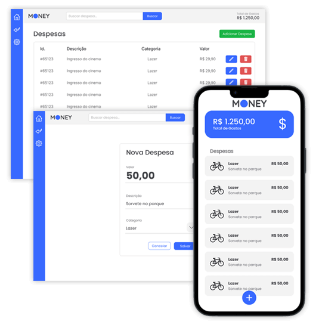

<p align="center">
  
</p>

## Projeto Money Web 💰 - Jornada JS DevPoint

### ✔️Sobre

Bem-vindo ao projeto Money - Controle de Despesas! Ele Foi desenvolvido para ajudar os usuários a gerenciar suas finanças pessoais de forma eficiente, e descomplicada. Com ele, é possível registrar despesas, consultar, excluir e manter o controle financeiro organizado e acessível.

Este é um projeto de despesas iniciado com [npx create-react-app](https://github.com/facebook/create-react-app)

#### 📌Instruções:

- **Instalar as dependências:** 
```
npm install
```
- **Executar o projeto:** 
```
npm start
```

#### 🚀Tecnologias Utilizadas - Breve Descrição

- **React:** Biblioteca JavaScript para criação da interface de usuário.


#### ## 📱 Captura de Tela do App

<p align="center">
  
</p>


